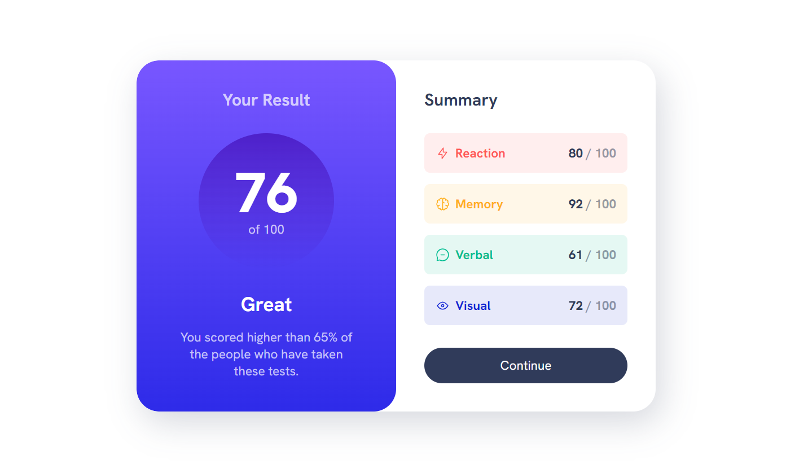

# Frontend Mentor - Results summary component solution

This is a solution to the [Results summary component challenge on Frontend Mentor](https://www.frontendmentor.io/challenges/results-summary-component-CE_K6s0maV). Frontend Mentor challenges help you improve your coding skills by building realistic projects. 

## Table of contents

- [Overview](#overview)
  - [The challenge](#the-challenge)
  - [Screenshot](#screenshot)
  - [Links](#links)
- [My process](#my-process)
  - [Built with](#built-with)
  - [What I learned](#what-i-learned)
- [Author](#author)

## Overview
### The challenge

Users should be able to:

- View the optimal layout for the interface depending on their device's screen size
- See hover and focus states for all interactive elements on the page
- **Bonus**: Use the local JSON data to dynamically populate the content

### Screenshot

### Links

- Live Site URL: [ **click** ](https://resultsummary24.netlify.app/)

## My process

### Built with

- Semantic HTML5 markup
- CSS custom properties
- Flexbox
- CSS Grid
- Mobile-first workflow

### What I learned
The ``HTML`` I provided utilizes the data attribute extensively
These data attributes provide a flexible way to extend the functionality of HTML elements beyond their standard attributes, making them quite powerful for web development. They can be accessed and manipulated via JavaScript for dynamic behavior or styled using CSS for custom styling based on the provided data.

## Author

- Name - Gaurav
- Frontend Mentor - [@Gaurav-GD24](https://www.frontendmentor.io/profile/Gaurav-GD24)
- Twitter - [@Gaurav_GD24](https://twitter.com/Gaurav_GD24)

